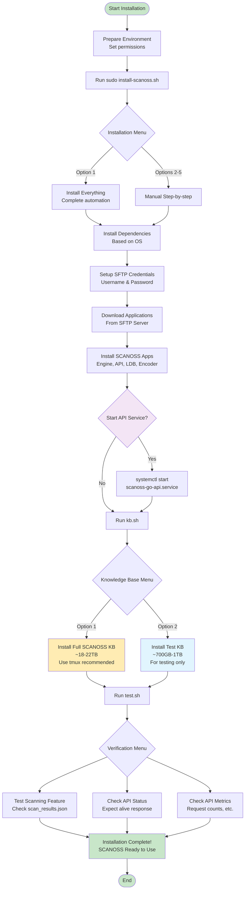

# SCANOSS On-Premise

## Table of Contents

- [TL;DR](#tl;dr)
- [Introduction](#introduction)
- [Hardware Requirements](#hardware-requirements)
  - [Full Knowledge Base Requirements](#full-knowledge-base-requirements)
  - [Test Knowledge Base Requirements](#test-knowledge-base-requirements)
- [Repository Contents](#repository-contents)
- [Installation Guide](#installation-guide)
  - [Preparing the Environment](#preparing-the-environment)
  - [Installing SCANOSS Applications](#installing-scanoss-applications)
  - [Knowledge Base Installation](#knowledge-base-installation)
    - [Installing the SCANOSS Knowledge Base](#installing-the-scanoss-knowledge-base)
    - [Installing the Test Knowledge Base (Optional)](#installing-the-test-knowledge-base-optional)
  - [Verifying Installation](#verifying-installation)
- [Configuration](#configuration)
    - [Manual Installation Workflow](#manual-installation-workflow)
    - [API Service Management](#api-service-management)
    - [API Configuration](#api-configuration)
- [Installation Flow Diagram](#installation-flow-diagram)

- [Support](#support)

---

## TL;DR 

1. Clone this repository: ```git clone https://github.com/scanoss/on-premise.git```
2. Add execution permissions to the installation scripts: ```cd on-premise/install/ && chmod +x *.sh```
3. Run the install-scanoss.sh script: ```sudo ./install-scanoss.sh```
4. Choose option 1) Install everything
5. Run the kb.sh script: ```sudo ./kb.sh```
6. There you will be prompted to choose between downloading the SCANOSS KB or the Test KB, select your preferred option and continue the script execution
7. Installation finished!

## Introduction

This document aims to guide users through the process of installing SCANOSS for on-premise environments.

This repository contains all necessary scripts for installing the SCANOSS Knowledge Base (SCANOSS KB), SCANOSS applications (engine, ldb, api and scanoss-encoder), dependencies, knowledge base updates and verifying a correct installation of every component.

To visualize the installation workflow, make sure to see the [Installation Flow Diagram](#installation-flow-diagram) at the end of this guide.

## Hardware Requirements

During installation you will be able to choose between installing the SCANOSS KB or the Test KB (which should only be used for testing, as it's not the complete knowledge base).

### Full Knowledge Base Requirements

The following is recommended for running the SCANOSS Applications and SCANOSS KB:

- Operating systems supported: Debian 11/12 and CentOS

|     | Minimum                   | Recommended               |
|-----|---------------------------|---------------------------|
| **CPU** | 8 Core x64 - 3.5 Ghz      | 32 Core x64 - 3.6 Ghz     |
| **RAM** | 32GB                      | 128GB                     |
| **HDD** | 19.2TB SSD (NVMe preferred) | 22TB SSD (NVMe preferred) |

### Test Knowledge Base Requirements

The following is recommended for running the SCANOSS Applications and SCANOSS Test KB:

- Operating systems supported: Debian 11/12 and CentOS

|     | Minimum                   | Recommended               |
|-----|---------------------------|---------------------------|
| **CPU** | 8 Core x64 - 3.5 Ghz      | 32 Core x64 - 3.6 Ghz     |
| **RAM** | 16GB                      | 32GB                      |
| **HDD** | 700GB SSD (NVMe preferred)| 1TB SSD (NVMe preferred)  | 

## Repository Contents

- [install-scanoss.sh](./install-scanoss.sh): bash script for installing SCANOSS (SFTP user setup creation, dependencies installation and application download/install)
- [kb.sh](./kb.sh): bash script for installing the SCANOSS KB
- [test.sh](./test.sh): bash script for verifying the correct installation of SCANOSS and the SCANOSS KB
- [resources](/resources): directory containing files for testing the installation of SCANOSS and the SCANOSS KB
- [config.sh](./config.sh): configuration file
- [kb-update.sh](../update): directory containing the knowledge base update guide and script

## Installation Guide

### Preparing The Environment 

You will receive en email from our Sales team containing the credentials to access our SFTP server, take note of those credentials as we are going to use them during the installation.

The first step would be cloning this repository using git:

```
git clone https://github.com/scanoss/on-premise.git
```

Make sure the scripts have execution permissions, if not add them with the following command:

```
cd on-premise/install/
chmod +x *.sh
```

> **_Note:_** These scripts needs to be run as root, either using ```sudo``` or directly as the root user.

### Installing SCANOSS Applications

The first script you'll need to run is ``install-scanoss.sh``, this script will take care of setting up your SFTP credentials, installing system/application dependencies and downloading/installing SCANOSS applications.

To run the command type:

```
sudo ./install-scanoss.sh
```

You will be prompted with an option menu, select option 1 ```Install everything``` for an automatic installation of SCANOSS.

After finishing the installation run ```sudo systemctl start scanoss-go-api.service``` to start the API service

> **_Note:_** For more information on installation options, API management and API configuration check [Configuration](#configuration) section at the end of this guide.

### Knowledge Base Installation

Here you are presented with downloading the [SCANOSS KB](#installing-the-scanoss-knowledge-base) or the [Test KB](#installing-the-test-knowledge-base-optional), follow the relevant guide to download your KB of choice.

#### Installing the SCANOSS Knowledge Base

When ```installation-script.sh``` is done, you can proceed to run the SCANOSS KB installation script ```kb.sh```.

To run the command type:

```
sudo ./kb.sh
```

After executing the script, you will be prompted with the following menu

```
SCANOSS KB Installation Menu
----------------------------
1) Install SCANOSS KB
2) Install Test KB
3) Quit
Enter your choice [1-2]:
```

If you choose the first option, the SCANOSS KB installation will start.

For users wanting to install the SCANOSS KB on the background, we recommend using ```tmux``` and following this procedure:

1. Install ```tmux```: ```sudo apt update && sudo apt install tmux``` for Debian or ```sudo yum install epel-release && sudo yum install tmux``` for CentOS.
2. Verify installation using ```tmux --version```
3. Create a tmux session and attach to it using ```tmux new-session -s mysession```
4. Run the ```kb.sh``` script inside of the tmux session, and begin installing the SCANOSS KB
5. After triggering the installation you can dettach from the session by pressing ```Ctrl+B``` and then ```d```, and attach again by using ```tmux attach -t mysession```

#### Installing the Test Knowledge Base (Optional)

When ```installation-script.sh``` is done, you can proceed to run the SCANOSS KB installation script ```kb.sh```.

To run the command type:

```
sudo ./kb.sh
```

After executing the script, you will be prompted with the following menu

```
SCANOSS KB Installation Menu
----------------------------
1) Install SCANOSS KB
2) Install Test KB
3) Quit
Enter your choice [1-2]:
```

If you choose the second option, the SCANOSS Test KB installation will start.

We also recommend using ```tmux``` to avoid the download from stopping due to session termination, but due to it being smaller in size (around 50GB) it isn't strictly necessary.

### Verifying installation

After running ```install.sh``` and ```kb.sh```, you will have installed everything you need to run SCANOSS.

The only thing left to do is verifying everything is functioning properly, and for that we will be using the ```test.sh```  script.

Before running this script, make sure the ```/resources``` folder has read permissions, if not add them with:

```
chmod -R +r /resources
```

To run the command type:

```
./test.sh
```

After executing the script, you will be prompted with the following menu

```
Starting verification script for SCANOSS...

Select options from the menu to verify different aspects of your environment
----------------------------------------------------------------------------
1) Verify scanning feature
2) Check API service status
3) Check API service metrics
4) Quit
```

The output to look for would be the following:

- For the ```Verify scanning feature``` option, you will get a file called ```scan_results.json```. Make sure the file is showing a file match for the test file located on the ```/resources``` folder.
- For the ```Check API service status``` you should get ```{"alive"}: true``` as a response.
- And, for the ```Check API service metrics``` you should get the number of requests, performed scans and so on.

After verifying every part of SCANOSS is working, the installation process would be finished

## Configuration

### Manual Installation Workflow

In some cases, users may prefer to manually trigger each step and maybe skipping one (e.g. users who may want to download packages from one computer, and installing them in another). So if you are in this situation, the correct workflow for manual trigger of options would be:

1. Install Dependencies: this will automatically download all required system dependencies, based on your OS
2. Setup SFTP Credentials: this option will prompt the user for their credentials (SFTP user and password)
3. Download Application: this option will let you choose between download application packages from our SFTP server, or downloading it manually (instructions for setting up the correct directory structure and permissions included on the script)
4. Install Application: this option will prompt the user with another menu with different options such as ```Install all applications and application dependencies```, ```Install application dependencies``` and options for installing each SCANOSS application separately.

> **_Note:_**  During the script, you will also be prompted for setting up installation paths and so on. We recommend using the default values for most options, this will make it easier for debugging if needed.

### API Service Management

By default, the script doesn't start the API service, in order to start it run the following command:

```
systemctl start scanoss-go-api.service
```

To check the status of the service run

```
systemctl status scanoss-go-api.service
```

And to stop the service run:

```
systemctl stop scanoss-go-api.service
```

### API Configuration

In case you want to modify the configuration of the API service, the configuration file will be located in ```/opt/scanoss/tmp/scripts/app-config-prod.json``` (defined by the APP_DIR variable in ```config.sh```).

Inside the configuration file, you will see multiple options such as app information, logging, telemetry, networking, TLS encryption and filtering. All the available configuration options are already present in the file, though some may be empty.

To restart the service with the new options you added/modified, run the ```install-scanoss.sh``` choose option 5) Install Application and then option 5) API, and the service will update with the new configuration.

## Installation Flow Diagram

<div style="width: 100%; max-width: 500px;">




## Support

If you encounter any issues with the scripts or have any questions, feel free to get in touch with us through the channels provided by the sales team.
